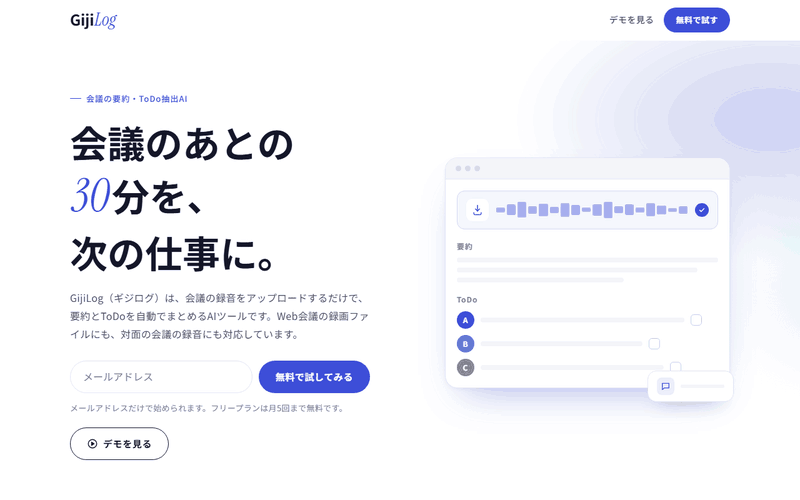

# GijiLog 新規登録LP

GijiLog（架空の議事録要約AIサービス）のLPを、Claude Codeで設計〜実装しました。

副業ポートフォリオ用の架空案件です。実在のクライアント・サービスはありません。

## デモ

`index.html` をブラウザで直接開くだけで表示できます（ビルド不要・1ファイル完結）。

## これは何

会議の録音をアップロードするだけで要約とToDoを自動抽出するAIツール「GijiLog（ギジログ）」の、無料トライアル登録用LPです。

想定ターゲットは中小企業・スタートアップの管理職やチームリーダーです。「会議の議事録を書く時間が惜しい」「ToDoが議事録に埋もれて流れてしまう」と感じている人に向けて、煽り文句や誇大な数字を使わず、「面倒な作業が減る」という実利を落ち着いたトーンで伝える構成にしています。

## ページ構成

| # | セクション | 役割 |
|---|---|---|
| 1 | ヒーロー | 何のツールかを一言で伝え、無料トライアル登録（メールアドレスのみ）と「デモを見る」の2つのCTAを置く |
| 2 | 課題 | ターゲットの悩み4点を言語化。「議事録に30分 × 1日3件 = 1.5時間」を図で見せる |
| 3 | 特徴 | 「アップロード → 要約 → ToDo」の流れ図と、発言者の振り分け・横断検索・チャット連携・録音の自動削除の4機能 |
| 4 | 料金 | フリープラン／チームプランの2プラン（金額は未確定の扱い） |
| 5 | 最終CTA | ページ末尾でもう一度、登録フォームとデモ導線を出す |

スマートフォン幅から組み始め、タブレット・デスクトップ幅へ段階的にレイアウトを広げています。

## 設計の考え方

**写真を使わずに成立させる。** 写真素材もUIのスクリーンショットもない前提の案件なので、「ここに写真が入ります」という空き枠は作らず、タイポグラフィ・配色・余白と、CSS/SVGで組んだ図解・アイコンだけで見せています。ヒーローの画面イメージも、実際の画面に見えないよう、ラベル以外はグレーの線で表現した抽象的なダミーです。

**あとから直す人が迷わないようにする。** 受託を想定し、納品後にクライアント側で手を入れやすい形にしています。

- ブランドカラーは `:root` の `--brand` 1行だけで変更できます。淡い色・濃い色はそこから `color-mix()` で自動生成しています。
- 確定していないコピーや金額には `<!-- CLIENT: ... -->` コメントを付け、どこが仮なのかをソース上で判別できるようにしています。料金のように確定値と誤解されると困る箇所は、画面上でも「―（確定次第表示）」と未確定であることが分かる表示にしています。

**参考デザインは「咀嚼して使う」。** 配色や構成の参考にはCanvaのテンプレートを複数使いましたが、特定の1枚を模倣せず、見出しの一語だけ書体を変える強調、濃い背景での課題提示、淡いグラデーション、大きなテキストロゴのフッターといった要素を組み合わせて独自の構成にしています。テンプレート画像そのものは使っておらず、リポジトリにも含めていません（Canvaの規約上、テンプレートの再配布にあたるため）。

## 技術スタック

- HTML / CSS / JavaScript（フレームワーク・ビルドツールなし、1ファイルにインライン）
- Google Fonts（Noto Sans JP / Shippori Mincho / Instrument Serif）

## 開発について

設計と実装には Claude Code（AIコーディング支援）を使っています。
仕様（ターゲット、CTA、課題、特徴、料金、トーン、スコープ外の線引き）は
[brief.md](./brief.md) にまとめています。

## 今回やらないこと（スコープ外）

- 実際のフォーム送信・API連携（登録フォームはダミーで、入力内容はブラウザのコンソールに出力するだけ）
- 多言語対応
- 競合との比較表
- ロゴのデザイン（テキストロゴで代替）

## ライセンス

個人のポートフォリオ／学習プロジェクトです。現時点でライセンスファイルは設定していません（無断転載・改変・商用利用は不可）。再利用可能な形にしたい場合は別途ライセンスを設定します。
